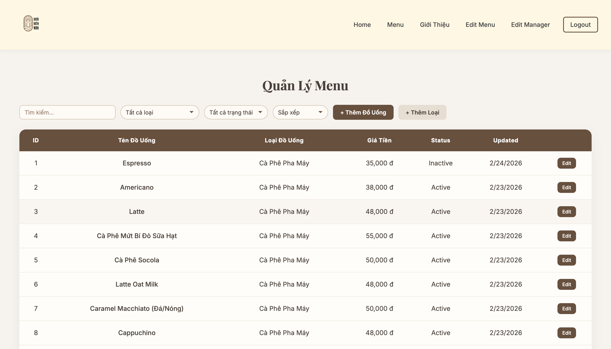
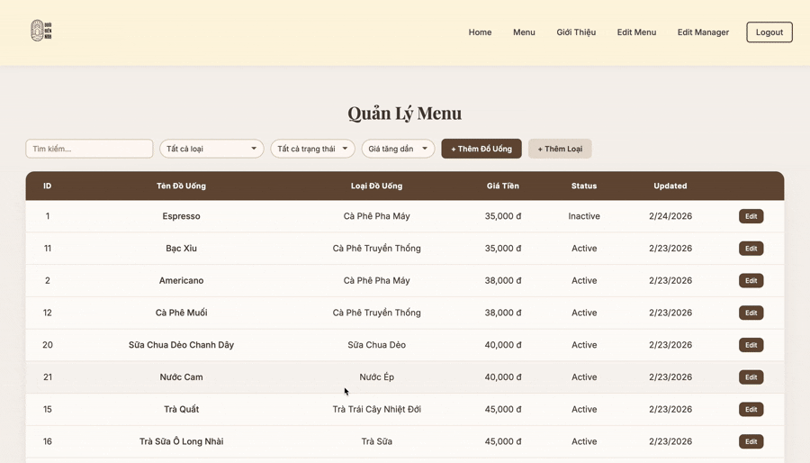

# Cafe Duoi Hien Nha

A full-stack coffee shop management system for a local café in Vinh, Vietnam — public menu, admin dashboard, and drink management.

**Live site:** https://cafeduoihiennha.com


---

## Tech Stack

- **Frontend:** React 18, Vite, CSS
- **Backend:** Spring Boot 3, Java 21
- **Database:** PostgreSQL (Supabase in production)
- **Auth:** JWT (HMAC-SHA)
- **Images:** Cloudinary
- **Deployment:** Vercel (frontend), Render (backend)

---

## Prerequisites

- Node.js 18+
- Java 21+
- Maven 3.9+
- Docker (for local PostgreSQL)

---

## Getting Started

### 1. Clone the repo

```bash
git clone https://github.com/your-username/capheduoihiennha_v1.git
cd capheduoihiennha_v1
```

### 2. Start the database

```bash
cd backend
docker-compose up -d
```

### 3. Configure environment variables

**Frontend** — create `frontend/.env`:
```
VITE_API_BASE_URL=http://localhost:8080/api/
VITE_WEBSITE_PASSWORD=your_site_password
MAP_EMBED_KEY=your_google_maps_key
```

**Backend** — create `backend/.env`:
```
DATABASE_URL=jdbc:postgresql://localhost:5432/mydb
DATABASE_USERNAME=admin
DATABASE_PASSWORD=admin123
JWT_SECRET=your_jwt_secret
JWT_EXPIRATION_MS=900000
FRONTEND_URL=http://localhost:5173
PORT=8080
```

### 4. Run the backend

```bash
cd backend
mvn spring-boot:run
```

### 5. Run the frontend

```bash
cd frontend
npm install
npm run dev
```

Frontend: http://localhost:5173 · Backend: http://localhost:8080

---

## Scripts

### Frontend (`/frontend`)

| Command | Description |
|---------|-------------|
| `npm run dev` | Start Vite dev server |
| `npm run build` | Production build |
| `npm run preview` | Preview production build |
| `npm run lint` | Run ESLint |

### Backend (`/backend`)

| Command | Description |
|---------|-------------|
| `mvn spring-boot:run` | Run locally |
| `mvn clean package -DskipTests` | Build JAR |
| `mvn test` | Run tests |

---

## Deployment

| Service | Provider |
|---------|----------|
| Frontend | Vercel — SPA rewrite rules in `frontend/vercel.json` |
| Backend | Render — multi-stage Docker build in `backend/Dockerfile` |
| Database | Supabase |
| Images | Cloudinary |

---

## Features

- Responsive design (mobile, tablet, desktop)
- Public menu page grouped by category with skeleton loading
- Admin dashboard with drink CRUD, search, and sort
- Soft-delete and hard-delete for menu items
- JWT-based auth with role-based access (`MANAGER`, `ADMIN`)
- Animated homepage sections with scroll-triggered entrance effects

---

## Screenshots

### Home Page


### Menu Page


### Dashboard


### Sorting and Searching


### Adding / Editing Drinks

