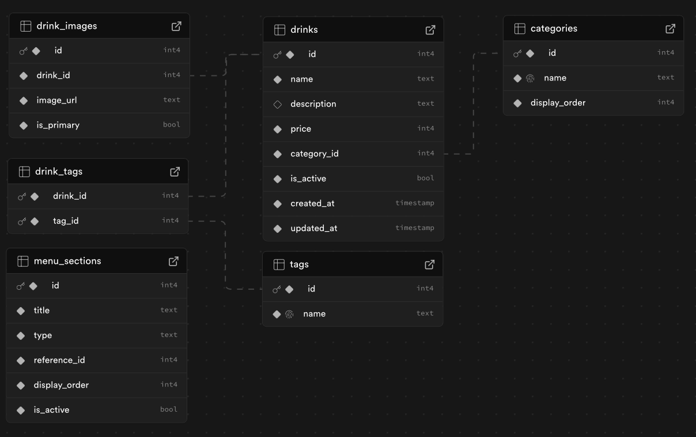

## 📊 Database Schema — Coffee Shop Menu

This database schema supports a simple and scalable coffee shop menu.
It includes categories, promotional tags (New / Popular), images, and
optional menu sections for UI layout.

The current version assumes **one size per drink**.

---

### Overall Design

---

### Tables Overview

- categories
- drinks
- tags
- drink_tags
- drink_images
- menu_sections (optional)

---

### categories

Stores the main menu categories.

| Column        | Type   | Description |
|---------------|--------|-------------|
| id            | PK     | Category ID |
| name          | string | Coffee, Tea, Signature |
| display_order | int    | Order in menu |

---

### drinks

Stores individual drink items.

| Column      | Type      | Description |
|-------------|-----------|-----------|
| id          | PK        | Drink ID |
| name        | string    | Drink name |
| description | text      | Drink description |
| price       | decimal   | Drink price (single size) |
| category_id | FK        | References categories.id |
| is_active   | boolean   | Enable / disable drink |
| created_at  | timestamp | Created time |
| updated_at  | timestamp | Updated time |

Each drink belongs to **exactly one category**.

---

### tags

Stores promotional tags.

| Column | Type   | Description |
|--------|--------|-----------|
| id     | PK     | Tag ID |
| name   | string | new, popular |

Initial values:
- new
- popular

---

### drink_tags

Associates drinks with tags.

| Column   | Type | Description |
|----------|------|-----------|
| drink_id | FK   | References drinks.id |
| tag_id   | FK   | References tags.id |

A drink may have zero, one, or multiple tags.

---

### drink_images

Stores images for drinks.

| Column     | Type    | Description |
|------------|---------|-----------|
| id         | PK      | Image ID |
| drink_id   | FK      | References drinks.id |
| image_url  | string  | Image URL |
| is_primary | boolean | Primary image |

A drink may have multiple images.

---

### menu_sections (optional)

Controls how the menu is displayed in the UI.

| Column        | Type    | Description |
|---------------|---------|-----------|
| id            | PK      | Section ID |
| title         | string  | Section title (e.g. New Drinks) |
| type          | enum    | tag or category |
| reference_id  | FK      | Tag ID or Category ID |
| display_order | int     | Section order |
| is_active     | boolean | Enable / disable section |

This table allows drinks to appear in multiple menu sections
(e.g. "New Drinks" and "Coffee") without duplicating data.

---

### Design Rules

- One drink belongs to one category
- Tags are used for dynamic labels (New, Popular)
- Menu sections are a presentation layer, not data ownership
- Drinks may appear in multiple UI sections

---

### Future Extensions

This schema can be extended to support:
- Multiple sizes and prices
- Add-ons and modifiers
- Location-based availability
- Sales-based popularity

No breaking changes required.
